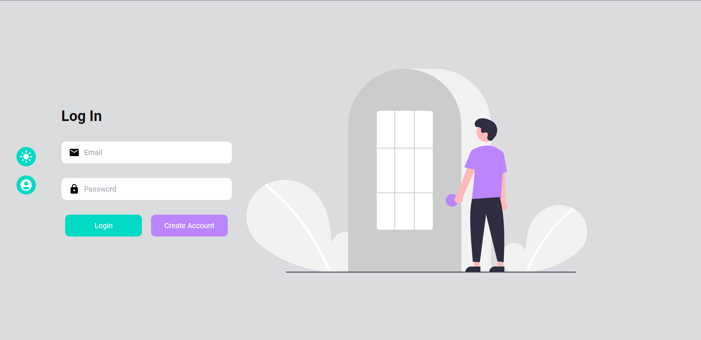

# **NetRow Point WeatherVisions - Weather App** ✅

Welcome to NetRow Point WeatherVisions, we combine the strength of precise weather predictions with the draw of eye-catching images to produce a completely immersive experience. Our project integrates the Unsplash Image API to display gorgeous images that capture the current weather conditions with the Open Weather API to provide you the most recent weather information for your region.

## Features

- ✅ Registration
- ✅ Login
- ✅ Weather information
- ✅ Image download

<table>
  <tr>
    <td>Login</td>
     <td>Create Account</td>
     
  </tr>
  <tr>
    <td></td>
    <td></td>
  </tr>

  <tr>
    <td>Login-Light</td>
     <td>Create Account-Light</td>
     
  </tr>
  <tr>
    <td></td>
    <td></td>
  </tr>

 </table>

 
 
 

## 🚀 Technologies

Front-End Development - JavaScript,React.js,Tailwind CSS
Back-End Development  - Node.js, Express.js, MongoDB